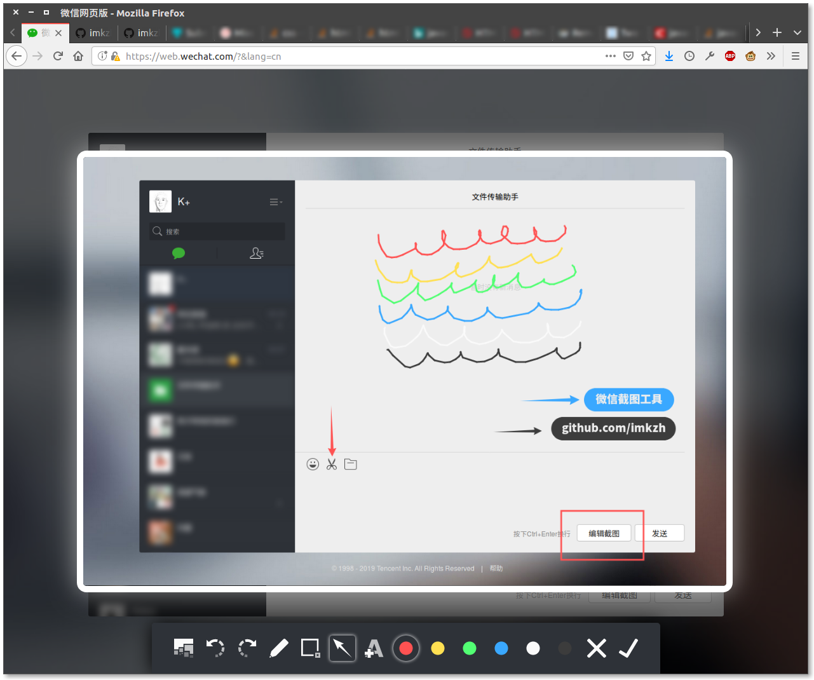

# 网页微信截图助手 WechatScreenshotHelper for Ubuntu

本项目包含：1、浏览器插件源代码，2、截图后端源代码

This repository contains both source code of the packed extension and screenshot backend.

# 下载链接(Download Links)

[最新版(Latest Version)](https://github.com/imkzh/WechatScreenshotHelper/releases/tag/r2.0.4)

# 帮助文档和说明(Documentations and Instructions)

点击[此处](./lang/README.zh-Hans.md)查看帮助文档和说明。

Documentations and instructions can be found [Here](./lang/README.en-US.md)

# 更新日志(Release Notes)

点击[此处](./lang/releases.md)(英文)查看更新日志。

Release Notes could be found [here](./lang/releases.md)。
